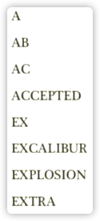
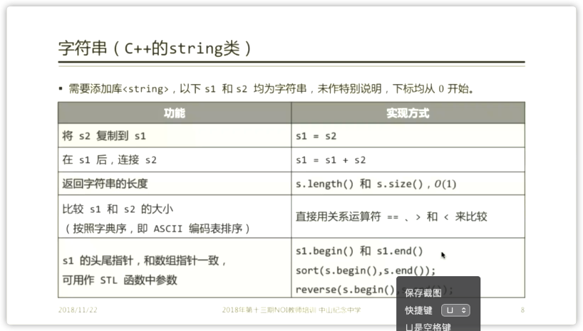
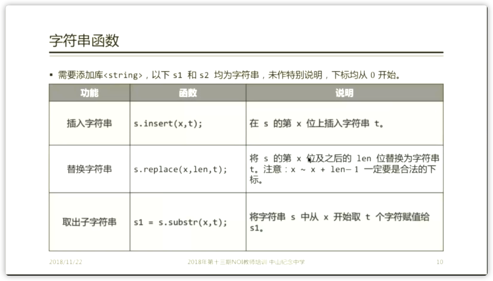
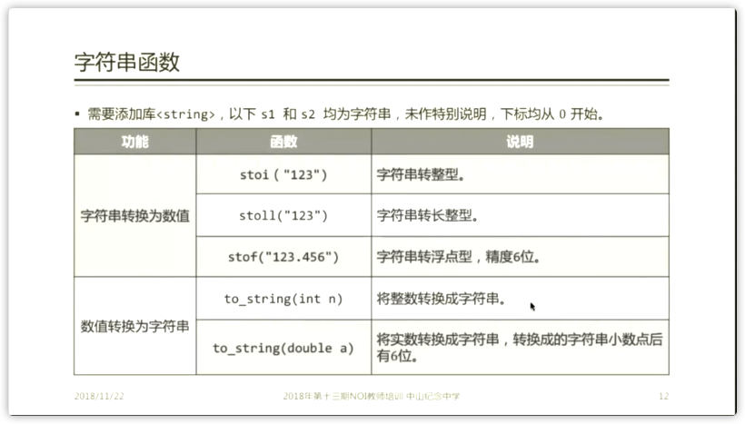
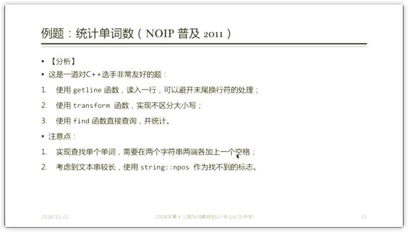
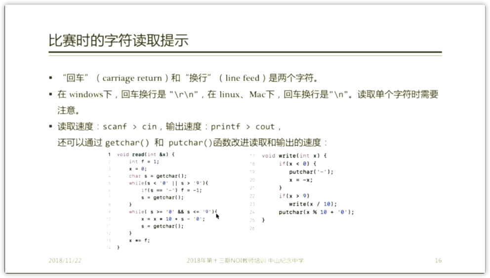
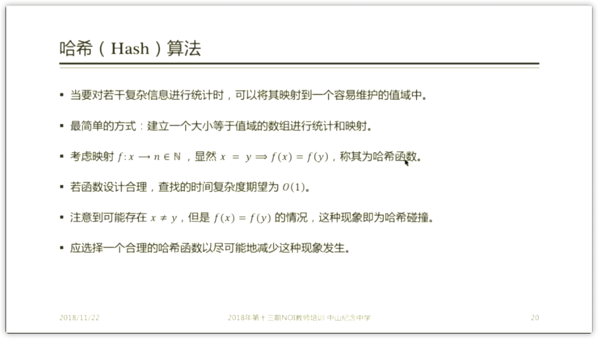
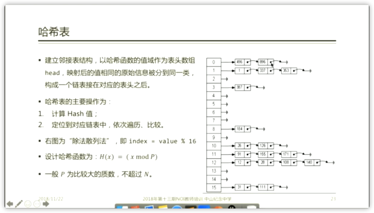
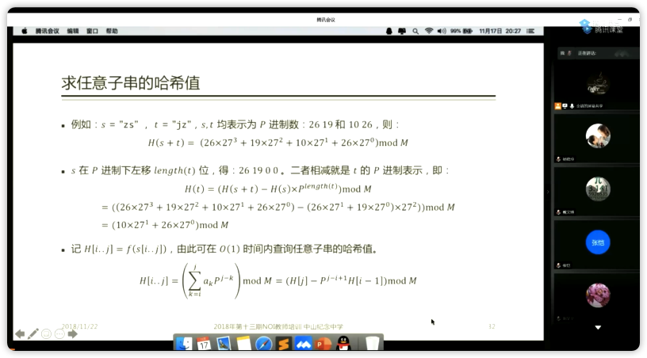

# 字符串算法
 > ## 华师大二附中 金靖

[toc]

## 字符串数组
> ```c
> #include<stdio.h>
> using namespace std;
> void main()
> {
>   char ch[100];
>   scanf("%s",ch);
>   return;
> }

## 字符数组的常见操作
需要包含头文件
```cpp
#include<cstring>
char s1[1001],s2[1001];
```
### 字符串复制
```cpp
strcpy(s1,s2)
```
### 字符串拼接
```cpp
strcat(s1,s2);
```
### 字符串测量长度
```cpp
strlen(s1)
```
### 字符串比较
```c
strcmp(s1,s2);
```
### 字符串查找
```cpp
strstr(s1,s2)-s1;
```

## 字典序

每个字符进行比较，按照`ABCDEFGHIJKLMNOPQRSTUVWXYZ`的顺序。
## 【例题】某年AtCoder的题目
[Luogu(AT163)](./AT163.htmlAT163)
~~[Luogu(AT163)](https://www.luogu.com.cn/problem/AT163)~~
[AtCoder Original](./arc003_2.html)
~~[AtCoder Original](https://atcoder.jp/contests/arc003/tasks/arc003_2)~~
## C++ String



### 字符串复制
```cpp
s1=s2
```
### 字符串拼接
```cpp
s1+=s1
```
### 字符串测量长度
```cpp
s1.length();
```
### 字符串比较
```c
s1<s2;
```
### 字符串查找
```cpp
s1.find(char);
```

## 【例题】NOIP2018标题统计
[Luogu P5015](./P5015.html)
~~[Luogu P5015](https://www.luogu.com.cn/problem/P5015)~~
## 【例题】NOIP2011统计单词数
[Luogu P1308](P1308.html)
~~[Luogu P1308](https://www.luogu.com.cn/problem/P1308)~~
[//]: 

## 字符串读取


## 字符串hash
#### 字符串哈希入门

说得通俗一点，字符串哈希实质上就是**把每个不同的字符串转成不同的整数**。

为什么会有这样的需要呢？很明显，存储一个超长的字符串和存储一个超大但是能存的下的整数，后者所占的空间会少的多，但主要还是为了方便**判断一个字符串是否出现过**，这是最基础的部分。

当然也很容易想到，如果有不同的字符串转成同一个整数，那么区分功能就基本废掉 ，所以我们需要一个算法把每个字符串转成**唯一的**整数。所以字符串哈希算法就应运而生，哈希算法的难点也就在于如何构造一个合适的Hash函数来满足我们的需求。

下面就简单介绍几种字符串哈希的基本方法。

#### 基本哈希方法

一般地，给定一个字符串 *𝑆*=*𝑠*_1_*𝑠*_2_*𝑠*_3_*𝑠*_4_...*𝑠*_𝑛_

，令$idx(x)=x-'a'+1$

，当然，直接(int)x（用它的ASCll码）也一样。

#### 自然溢出法

这种方法是利用数据结构`unsigned long long`的范围自然溢出：即当存储的数据大于`unsigned long long`的存储范围时，会自动mod 2^64^−1

，就不用mod其他质数来保证唯一性了。

#### Hash公式

```
unsigned long long Hash[n]
hash[i]=hash[i−1]∗p+idx(s[i]);
```

注意：这里的p一定要是个质数，不然可能无法保证唯一性。

#### 单Hash法

相当于自然溢出法没有了自动取模的操作，所以需要自己进行取模操作。但是这种Hash方法在模数较小的时候的稳定性不一定得到保证，所以在这个方面不如其他方法。

#### Hash公式

```
hash[i]=(hash[i−1])∗p+idx(s[i])%mod;
```

注意：这里的*𝑝*

和*𝑚**𝑜**𝑑*都是质数，且满足*𝑝*<*𝑚**𝑜**𝑑*。最好在选取的时候把*𝑝*和*𝑚**𝑜**𝑑*

的值取大一点。

###### 举例

如取*𝑝*=13,*𝑚**𝑜**𝑑*=101

，对字符串*𝑎**𝑏**𝑐*

进行Hash

```
hash[0]=1;
hash[1]=(hash[0] × 13 + 2)%101=15;
hash[2]=(hash[1] × 13 + 3)%101=97;
```

所以最终字符串*𝑎**𝑏**𝑐*

的hash值就是97

#### 双Hash法

> 其实网上很多博客讲了多Hash，但我觉得双Hash已经足够稳定了，再多一些也只是浪费时间而已。

顾名思义，双Hash就是对一个hash值用两个不同的质数进行两次*𝑚**𝑜**𝑑*

操作，然后最后用一对数$<hash1[n],hash2[n]>$

来表示一个字符串的哈希值，这样的一对数的重复几率加上选择较大的质数，冲突率几乎为0。

#### Hash方法

```
hash1[i]=(hash1[i−1])∗p+idx(s[i]) % mod1
hash2[i]=(hash2[i−1])∗p+idx(s[i]) % mod2
```

**这样的哈希很安全**

#### Hash素数的选择

为了防止冲突，要选择合适的素数，像1e9+7,1e9+9的一些素数，出题人一般会卡一下下，所以尽量选择其他的素数，防止被卡。下面是一些可供选择的素数。
 上界和下界指的是离素数最近的2*𝑛*

的值。

|                                                              |      |           |            |
| ------------------------------------------------------------ | ---- | --------- | ---------- |
| lwr                                                          | upr  | % err     | prime      |
| 2^5                                                          | 2^6  | 10.416667 | 53         |
| 2^6                                                          | 2^7  | 1.041667  | 97         |
| 2^7                                                          | 2^8  | 0.520833  | 193        |
| 2^8                                                          | 2^9  | 1.302083  | 389        |
| 2^9                                                          | 2^10 | 0.130208  | 769        |
| 2^10                                                         | 2^11 | 0.455729  | 1543       |
| 2^11                                                         | 2^12 | 0.227865  | 3079       |
| 2^12                                                         | 2^13 | 0.113932  | 6151       |
| 2^13                                                         | 2^14 | 0.008138  | 12289      |
| 2^14                                                         | 2^15 | 0.069173  | 24593      |
| 2^15                                                         | 2^16 | 0.010173  | 49157      |
| 2^16                                                         | 2^17 | 0.013224  | 98317      |
| 2^17                                                         | 2^18 | 0.002543  | 196613     |
| 2^18                                                         | 2^19 | 0.006358  | 393241     |
| 2^19                                                         | 2^20 | 0.000127  | 786433     |
| 2^20                                                         | 2^21 | 0.000318  | 1572869    |
| 2^21                                                         | 2^22 | 0.000350  | 3145739    |
| 2^22                                                         | 2^23 | 0.000207  | 6291469    |
| 2^23                                                         | 2^24 | 0.000040  | 12582917   |
| 2^24                                                         | 2^25 | 0.000075  | 25165843   |
| 2^25                                                         | 2^26 | 0.000010  | 50331653   |
| 2^26                                                         | 2^27 | 0.000023  | 100663319  |
| 2^27 | 2^28 | 0.000009  | 201326611  |
| 2^28 | 2^29 | 0.000001  | 402653189  |
| 2^29 | 2^30 | 0.000011  | 805306457  |
| 2^30                 | 2^31 | 0.000000  | 1610612741 |

#### 获取子串的hash

如果我们求出一个串的Hash，就可以*𝑂*(1)

求解其子串的Hash值。
 公式的推导太复杂...干脆直接贴上来 （绝对不是我想偷懒）
 公式

若已知一个|𝑆|=𝑛的字符串的hash值，ℎ𝑎𝑠ℎ[𝑖],1≤𝑖≤𝑛，其子串𝑠𝑙..𝑠𝑟,1≤𝑙≤𝑟≤𝑛，对应的hash值为：$hash=((hash[r]−hash[l−1]∗p^{r−l+1})\%mod+mod)\%mod$

## 【例题】分身数对
[WZOI](https://wzoi.cc/s/1/2475)

## HASH算法



## 【例题】雪花

[POJ 3349](problem?id=3349.html)
~~[POJ 3349](http://poj.org/problem?id=3349)~~
## 求任意字串的哈希值


